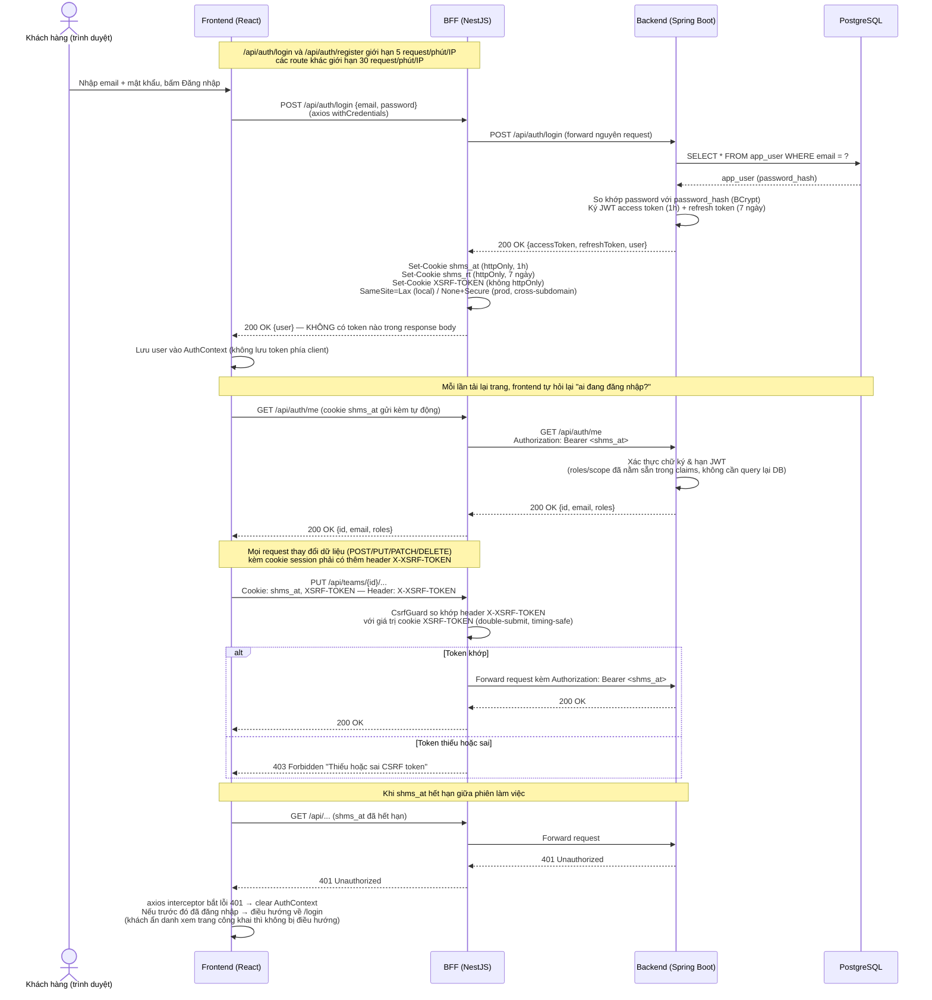
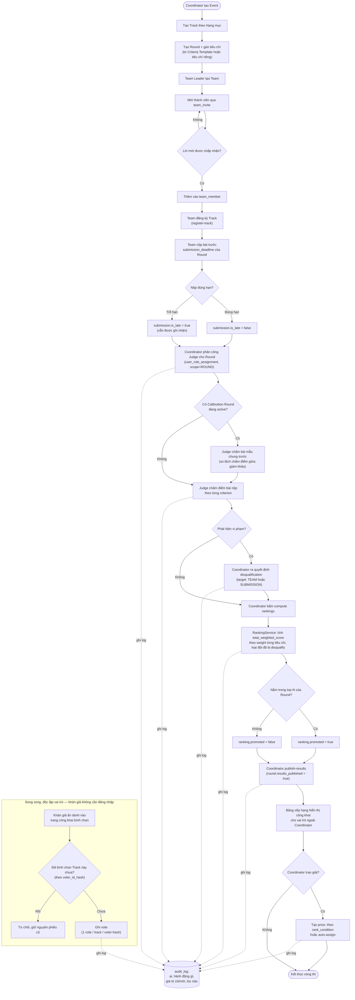

# Seal Hackathon Webapp

Hệ thống quản lý và chấm điểm cuộc thi hackathon: đăng ký đội, nộp bài, phân công giám khảo, chấm điểm theo tiêu chí, xếp hạng và công bố kết quả.

**Demo trực tuyến:** https://sealhackathon.onrender.com

## Kiến trúc

Monorepo gồm 3 phần:

```
├── backend/    Spring Boot 4 (Java 21) — REST API, nghiệp vụ chính, JWT auth, JPA/PostgreSQL
├── bff/        Node.js (NestJS) — Backend-For-Frontend, giữ JWT trong cookie httpOnly, proxy sang backend
└── frontend/   React + TypeScript + Vite — giao diện người dùng
```

Luồng dữ liệu: `Trình duyệt → frontend (React) → bff (Node) → backend (Spring Boot) → PostgreSQL`

BFF tồn tại để trình duyệt không bao giờ thấy JWT trực tiếp — token được lưu trong cookie `httpOnly`, mọi request từ frontend đi qua BFF trước khi tới backend thật.

## Vai trò người dùng

- **Coordinator** (Ban tổ chức): tạo sự kiện, vòng thi, Hạng mục, tiêu chí chấm điểm, phân công giám khảo, công bố kết quả, duyệt tài khoản.
- **Team Leader / Team Member**: tạo/tham gia đội, đăng ký Hạng mục, nộp bài theo từng vòng thi.
- **Judge** (giám khảo, bao gồm giám khảo khách mời): chấm điểm bài nộp được phân công theo tiêu chí.
- **Mentor**: theo dõi các đội trong Hạng mục được phân công.

## Mô hình dữ liệu (ERD)

Toàn bộ schema được quản lý bằng Flyway (`backend/src/main/resources/db/migration`, V1–V5), gồm 20 bảng. Sơ đồ dưới đây lược bỏ `created_at`/`updated_at` ở mọi bảng (bảng nào cũng có 2 cột audit này) để gọn hơn; kiểu dữ liệu được rút gọn (`VARCHAR(n)` → `string`, `NUMERIC(p,s)` → `decimal`, `TIMESTAMPTZ` → `timestamp`).

### Sơ đồ quan hệ thực thể

```mermaid
erDiagram
    app_user {
        uuid id PK
        string full_name
        string email UK
        string password_hash
        string user_category
        string student_code
        string school_name
        string account_status
        boolean guest_judge
        timestamp guest_access_expires_at
        string rejection_reason
    }

    user_role_assignment {
        uuid id PK
        uuid user_id FK
        string role_name
        string scope_type
        uuid scope_id "nullable - trỏ tới event/track/round tùy scope_type, không phải FK cứng"
        string judge_type "nullable - INTERNAL hoặc GUEST"
    }

    criteria_template {
        uuid id PK
        string name
        text description
        boolean is_default
    }

    hackathon_event {
        uuid id PK
        string name
        text description
        date start_date
        date end_date
        string status
        uuid base_criteria_template_id FK "nullable"
        boolean rbl_enabled
    }

    track {
        uuid id PK
        uuid event_id FK
        string name
        text description
        int max_teams
    }

    round {
        uuid id PK
        uuid event_id FK
        string name
        int order_index
        timestamp submission_deadline
        int promotion_top_n
        boolean results_published
    }

    criterion {
        uuid id PK
        uuid template_id FK "nullable - xor với round_id"
        uuid round_id FK "nullable - xor với template_id"
        string name
        text description
        decimal weight
        decimal max_score
    }

    team {
        uuid id PK
        uuid event_id FK
        string name
        uuid track_id FK "nullable"
        string status
    }

    team_member {
        uuid id PK
        uuid team_id FK
        uuid user_id FK
        string role_in_team
    }

    team_invite {
        uuid id PK
        uuid team_id FK
        string invited_email
        string status
    }

    submission {
        uuid id PK
        uuid team_id FK
        uuid round_id FK
        string repo_url
        string demo_url
        string doc_url
        text repo_metadata_json
        timestamp submitted_at
        boolean is_late
    }

    score {
        uuid id PK
        uuid submission_id FK
        uuid judge_id FK
        uuid criterion_id FK
        decimal score_value
        text comment
        boolean finalized
        timestamp scored_at
        boolean judge_calibrated
    }

    ranking {
        uuid id PK
        uuid team_id FK
        uuid round_id FK
        decimal total_weighted_score
        int rank_in_track
        int rank_overall
        boolean promoted
    }

    disqualification {
        uuid id PK
        string target_type
        uuid team_id FK "nullable - tùy target_type"
        uuid submission_id FK "nullable - tùy target_type"
        text reason
        uuid decided_by FK
        timestamp decided_at
        boolean revoked
    }

    prize {
        uuid id PK
        uuid event_id FK
        uuid track_id FK "nullable"
        string name
        int rank_condition
        uuid awarded_team_id FK "nullable"
        boolean revoked
    }

    audit_log {
        uuid id PK
        uuid actor_id FK "nullable"
        string action
        string entity_type
        uuid entity_id "polymorphic, không phải FK cứng"
        text old_value_json
        text new_value_json
        timestamp timestamp
    }

    calibration_round {
        uuid id PK
        uuid event_id FK
        uuid sample_submission_id FK
        string name
        boolean active
    }

    calibration_score {
        uuid id PK
        uuid calibration_round_id FK
        uuid judge_id FK
        uuid criterion_id FK
        decimal score_value
    }

    mentor_feedback_message {
        uuid id PK
        uuid team_id FK
        uuid author_user_id FK
        string author_role
        text body
    }

    vote {
        uuid id PK
        uuid team_id FK
        uuid track_id FK
        string voter_id_hash
        string ip_hash
    }

    app_user ||--o{ user_role_assignment : "được gán vai trò"
    app_user ||--o{ team_member : "tham gia đội"
    app_user ||--o{ score : "chấm điểm"
    app_user ||--o{ calibration_score : "chấm điểm mẫu"
    app_user ||--o{ mentor_feedback_message : "gửi phản hồi"
    app_user ||--o{ disqualification : "ra quyết định loại"
    app_user |o--o{ audit_log : "thực hiện hành động"

    criteria_template |o--o{ criterion : "định nghĩa tiêu chí dùng chung"
    criteria_template |o--o{ hackathon_event : "làm mẫu tiêu chí gốc cho"

    hackathon_event ||--o{ track : "chia thành"
    hackathon_event ||--o{ round : "gồm các vòng"
    hackathon_event ||--o{ team : "có đội đăng ký"
    hackathon_event ||--o{ prize : "trao giải trong"
    hackathon_event ||--o{ calibration_round : "tổ chức hiệu chuẩn"

    track |o--o{ team : "đội đăng ký theo"
    track |o--o{ prize : "trao giải theo hạng mục"
    track ||--o{ vote : "nhận bình chọn theo"

    round |o--o{ criterion : "định nghĩa tiêu chí riêng"
    round ||--o{ submission : "nhận bài nộp"
    round ||--o{ ranking : "tạo bảng xếp hạng"

    team ||--o{ team_member : "gồm thành viên"
    team ||--o{ team_invite : "gửi lời mời tham gia"
    team ||--o{ submission : "nộp bài"
    team ||--o{ ranking : "được xếp hạng"
    team ||--o{ mentor_feedback_message : "nhận phản hồi mentor"
    team ||--o{ vote : "được bình chọn"
    team |o--o{ disqualification : "bị loại (target=TEAM)"
    team |o--o{ prize : "được trao giải"

    submission ||--o{ score : "được chấm điểm"
    submission |o--o{ disqualification : "bị loại (target=SUBMISSION)"
    submission ||--o{ calibration_round : "được chọn làm bài mẫu"

    criterion ||--o{ score : "áp dụng khi chấm điểm"
    criterion ||--o{ calibration_score : "áp dụng khi chấm điểm mẫu"

    calibration_round ||--o{ calibration_score : "nhận điểm hiệu chuẩn"
```



> Hai quan hệ đặc biệt không thể hiện hết bằng cardinality thường: `criterion` chỉ được gắn với **đúng một trong hai** `criteria_template`/`round` (ràng buộc `CHECK` ở DB, không bao giờ cả hai hoặc không cái nào); `disqualification` cũng chỉ nhắm vào **đúng một trong hai** `team`/`submission` tùy `target_type`. Cả hai được vẽ thành 2 quan hệ optional tách rời vì ERD không biểu diễn được ràng buộc "loại trừ lẫn nhau" giữa 2 quan hệ khác nhau.

### Nhóm bảng chính

**Người dùng & phân quyền**
- `app_user` — Tài khoản duy nhất cho mọi vai trò (Coordinator, Judge, Mentor, Team Leader/Member); lưu trạng thái duyệt tài khoản (`account_status`) và cờ giám khảo khách mời có hạn truy cập (`guest_judge`, `guest_access_expires_at`).
- `user_role_assignment` — Gán vai trò cho người dùng theo phạm vi (`scope_type`: GLOBAL/EVENT/TRACK/ROUND + `scope_id`); một người có thể giữ nhiều vai trò ở nhiều phạm vi khác nhau cùng lúc.

**Cấu trúc cuộc thi**
- `hackathon_event` — Một sự kiện hackathon, gốc của toàn bộ cây dữ liệu (track/round/team/prize đều thuộc về một event).
- `track` — "Hạng mục" thi trong một event, giới hạn số đội tối đa (`max_teams`).
- `round` — Vòng thi trong một event, có deadline nộp bài riêng (`submission_deadline`) và số đội được vào vòng trong (`promotion_top_n`).
- `criteria_template` — Bộ tiêu chí chấm điểm dùng lại được giữa nhiều event/round.
- `criterion` — Một tiêu chí chấm điểm cụ thể (trọng số, điểm tối đa); thuộc về đúng một trong hai nguồn — `criteria_template` dùng chung hoặc `round` cụ thể.

**Đội thi**
- `team` — Đội tham gia một event, có thể đăng ký vào một track cụ thể.
- `team_member` — Thành viên trong đội (LEADER/MEMBER), mỗi user chỉ tham gia một lần trong cùng một đội.
- `team_invite` — Lời mời tham gia đội gửi tới một email (PENDING/ACCEPTED/DECLINED); người được mời chưa chắc đã có tài khoản.

**Bài nộp & chấm điểm**
- `submission` — Bài nộp của một đội cho một round (repo/demo/tài liệu), đúng một bài/đội/round, đánh dấu nộp trễ (`is_late`).
- `score` — Điểm một giám khảo chấm cho một tiêu chí của một bài nộp; có thể chốt (`finalized`) và đánh dấu đã hiệu chuẩn (`judge_calibrated`).
- `calibration_round` — Đợt hiệu chuẩn giám khảo: chọn một bài nộp mẫu để mọi giám khảo cùng chấm thử, đo độ lệch chấm điểm giữa các giám khảo (RBL — Rater Bias/Leniency) trước khi chấm thật.
- `calibration_score` — Điểm giám khảo chấm cho bài mẫu trong một đợt hiệu chuẩn.

**Kết quả & xử lý vi phạm**
- `ranking` — Kết quả xếp hạng của một đội trong một round: tổng điểm có trọng số, hạng trong track, hạng chung, cờ được vào vòng trong (`promoted`).
- `disqualification` — Quyết định loại, nhắm vào một đội **hoặc** một bài nộp cụ thể (không bao giờ cả hai), có thể thu hồi (`revoked`).
- `prize` — Giải thưởng của một event (có thể giới hạn theo track), gắn điều kiện xếp hạng (`rank_condition`) và đội được trao.

**Tương tác công khai & vận hành**
- `mentor_feedback_message` — Tin nhắn phản hồi qua lại giữa mentor và đội, dạng luồng chat theo từng đội.
- `vote` — Bình chọn ẩn danh của khán giả cho một đội trong một track; định danh bằng hash (`voter_id_hash`, `ip_hash`), không lưu PII thô, giới hạn 1 phiếu/track/người.
- `audit_log` — Nhật ký các hành động quan trọng (ai, hành động gì, trên entity nào, giá trị trước/sau), phục vụ truy vết và minh bạch.

### Quan hệ chính giữa các bảng

1. One-to-Many (1-N) - `hackathon_event` và `track`: Một sự kiện chia thành nhiều Hạng mục; mỗi track chỉ thuộc đúng một sự kiện.
2. One-to-Many (1-N) - `hackathon_event` và `round`: Một sự kiện gồm nhiều vòng thi theo thứ tự (`order_index`); mỗi round thuộc đúng một sự kiện.
3. One-to-Many (1-N) - `criteria_template` và `criterion`: Một bộ tiêu chí mẫu chứa nhiều tiêu chí dùng chung cho nhiều round khác nhau.
4. One-to-Many (1-N) - `round` và `criterion`: Một round có thể tự định nghĩa tiêu chí riêng, không cần template; mỗi tiêu chí kiểu này thuộc đúng một round.
5. One-to-Many (1-N) - `hackathon_event` và `team`: Một sự kiện có nhiều đội đăng ký tham gia.
6. One-to-Many (1-N) - `team` và `team_member`: Một đội có nhiều thành viên; mỗi thành viên gắn với đúng một đội.
7. One-to-Many (1-N) - `team` và `team_invite`: Một đội có thể gửi nhiều lời mời tham gia (theo email) đang chờ phản hồi.
8. One-to-Many (1-N) - `round` và `submission`: Một round nhận bài nộp từ nhiều đội, nhưng mỗi đội chỉ được nộp đúng một bài cho round đó.
9. One-to-Many (1-N) - `submission` và `score`: Một bài nộp nhận nhiều dòng điểm — mỗi giám khảo chấm riêng cho từng tiêu chí.
10. One-to-Many (1-N) - `app_user` và `user_role_assignment`: Một người dùng có thể giữ nhiều vai trò, mỗi vai trò gắn một phạm vi riêng.
11. One-to-Many (1-N) - `round` và `ranking`: Một round tạo ra nhiều dòng xếp hạng, mỗi dòng ứng với một đội trong round đó.
12. One-to-Many (1-N) - `hackathon_event` và `prize`: Một sự kiện có thể có nhiều giải thưởng, mỗi giải thuộc đúng một sự kiện.
13. One-to-Many (1-N) - `calibration_round` và `calibration_score`: Một đợt hiệu chuẩn nhận điểm chấm mẫu từ nhiều giám khảo khác nhau.
14. One-to-Many (1-N) - `team` và `vote`: Một đội có thể nhận nhiều lượt bình chọn từ khán giả, giới hạn 1 phiếu cho mỗi cặp track + người bình chọn.

## Luồng nghiệp vụ chính

### Xác thực & phiên đăng nhập

Hệ thống dùng JWT tự phát hành (không qua bên thứ ba như Firebase) — backend Spring Boot ký và xác thực token, BFF là nơi duy nhất giữ token, frontend không bao giờ chạm vào JWT.



### Vòng đời một lượt thi: đội → nộp bài → chấm điểm → xếp hạng → công bố

Luồng nghiệp vụ trung tâm của hệ thống, chạm tới hầu hết các bảng trong schema.



## Chạy dự án tại local

### Yêu cầu môi trường

| Công cụ | Phiên bản | Dùng để |
|---|---|---|
| JDK | 21 | Chạy backend (Spring Boot 4) |
| Node.js | 20+ (khuyến nghị 22 — đúng bản dùng trong Dockerfile) | Chạy bff (NestJS) và frontend (Vite) |
| PostgreSQL | 16 | Database, nếu không chạy qua Docker |
| Docker + Docker Compose | bản mới nhất | Cách nhanh nhất để chạy toàn bộ hệ thống, không cần cài JDK/Node/PostgreSQL riêng lẻ |

### Cách nhanh nhất: Docker Compose

```bash
cp .env.example .env
# Mở .env, điền JWT_SECRET — bắt buộc, compose sẽ báo lỗi và không start nếu thiếu
# Gợi ý tạo secret: openssl rand -base64 32

docker compose up --build
```

Sau khi cả 4 service (`postgres`, `backend`, `bff`, `frontend`) qua healthcheck:
- Frontend: http://localhost:3000
- BFF: http://localhost:4001
- Backend: http://localhost:8080 (Swagger UI: `/swagger-ui.html`)

### Chạy thủ công từng phần

Xem hướng dẫn chi tiết (biến môi trường, Spring profile, route map, cookie/CSRF, test...) ở README riêng từng service:
- [backend/README.md](backend/README.md) — cấu hình, biến môi trường, cách chạy, test
- [bff/README.md](bff/README.md) — kiến trúc, biến môi trường, route map, cookie/CSRF, cách chạy, test
- [frontend/README.md](frontend/README.md) — cài đặt, biến môi trường, route map, cách chạy, test

## Triển khai

| Dịch vụ | Công nghệ | Ghi chú |
|---|---|---|
| PostgreSQL | `postgres:16-alpine` (Docker) | Chạy qua Docker Compose ở local, volume `postgres_data` để persist dữ liệu, healthcheck bằng `pg_isready`. |
| Backend | Spring Boot 4 / Java 21 — Dockerfile multi-stage `eclipse-temurin:21-jdk` → `eclipse-temurin:21-jre`, chạy dưới user non-root `spring` | Expose port 8080, healthcheck qua `/actuator/health`. Bắt buộc override `JWT_SECRET`/`DB_PASSWORD` khi deploy thật, không dùng giá trị mặc định dev. |
| BFF | NestJS trên `node:22-alpine` | Expose port 4001, healthcheck qua endpoint `GET /health` riêng (độc lập với actuator của backend). |
| Frontend | React 19 + Vite, build tĩnh rồi serve qua `nginx:alpine` | `nginx.conf` chỉ có SPA fallback (`try_files ... /index.html`), không có rule reverse-proxy — frontend gọi thẳng BFF cross-origin qua biến `VITE_BFF_URL` (inject lúc build, không hardcode). |
| CI/CD | — chưa cấu hình | Repo hiện chưa có pipeline nào được commit (không có `.github/workflows`, `render.yaml`, `Procfile`, `vercel.json`...). Build và deploy hiện tại phải làm thủ công. |

**Về môi trường online:** demo tại `https://sealhackathon.onrender.com` cho thấy hệ thống chạy trên **Render** — comment trong `bff/src/common/cookies.ts` và `bff/README.md` xác nhận "frontend và BFF chạy trên 2 subdomain khác nhau của `onrender.com`" (lý do cookie auth phải dùng `SameSite=None` ở production). Tuy nhiên, **địa chỉ subdomain cụ thể của từng service (backend, BFF) không được commit ở bất kỳ đâu trong repo** — các URL đó chỉ tồn tại dưới dạng biến môi trường (`VITE_BFF_URL`, `BACKEND_URL`, `CORS_ALLOWED_ORIGINS`) cấu hình trực tiếp trên nền tảng hosting lúc build/deploy, không nằm trong mã nguồn. Nói cách khác, cấu hình triển khai production hiện **không nằm trong phạm vi repo** này — cách duy nhất được xác nhận đầy đủ và tái lập được để chạy toàn bộ hệ thống là Docker Compose ở local (xem phần "Chạy dự án tại local").

## Công nghệ sử dụng

- **Backend**: Spring Boot 4, Spring Security (JWT), Spring Data JPA, Flyway (quản lý schema DB), springdoc-openapi (Swagger)
- **BFF**: NestJS, Axios, cookie-parser
- **Frontend**: React 19, TypeScript, Vite, React Router
- **Database**: PostgreSQL

## Tài liệu API

Sau khi chạy backend, xem Swagger UI tại `/swagger-ui.html` (local: `http://localhost:8080/swagger-ui.html`).

## Nhật ký thay đổi

Lịch sử phát triển tính đến commit mới nhất, chia theo 4 giai đoạn dựa trên nội dung thực tế của các commit.

### Giai đoạn 1 — Khởi tạo & đóng gói ban đầu (2026-07-24)

| Ngày | Commit | Thay đổi |
|---|---|---|
| 2026-07-24 | `522990c` | Initial commit: dựng khung toàn bộ hệ thống quản lý hackathon SEAL (backend, bff, frontend). |
| 2026-07-24 | `d617e6f` | Bỏ tên và mô tả dự án khỏi README. |
| 2026-07-24 | `0d49781` | Thêm Dockerfile cho backend/bff/frontend và `docker-compose.yml` gốc để chạy cả hệ thống bằng một lệnh. |
| 2026-07-24 | `f40f8ad` | Merge nhánh `main` từ repo GitHub `BryannLee202/Seal_Hackathon_Webapp`. |
| 2026-07-24 | `db33e6a` | Sửa lỗi mục lục (table of contents) bị hỏng trong tài liệu SRS. |

### Giai đoạn 2 — Củng cố độ tin cậy & bảo mật nền tảng (2026-07-25)

| Ngày | Commit | Thay đổi |
|---|---|---|
| 2026-07-25 | `af33161` | Thêm test, vá lỗ hổng phân quyền IDOR (truy cập chéo dữ liệu không đúng quyền sở hữu), làm chặt xử lý lỗi, thêm phân trang. |
| 2026-07-25 | `1516b47` | Fail fast khi có sự cố kết nối DB thay vì treo ứng dụng âm thầm. |
| 2026-07-25 | `38083f4` | Ép JVM dùng `SecureRandom` non-blocking để sửa lỗi treo khởi động âm thầm trên Render (nghẽn entropy). |
| 2026-07-25 | `650a242` | Dùng cookie `SameSite=None` ở production để auth hoạt động đúng khi frontend/BFF nằm trên 2 subdomain khác nhau. |

### Giai đoạn 3 — Tài liệu, giao diện & tính năng nghiệp vụ mới (2026-07-25)

| Ngày | Commit | Thay đổi |
|---|---|---|
| 2026-07-25 | `b742136` | Thêm README tổng quan dự án ở thư mục gốc. |
| 2026-07-25 | `ccbaddb` | Thêm Tailwind CSS + Framer Motion, mở rộng landing page. |
| 2026-07-25 | `e0dc615` | Chuyển form đăng ký và nộp bài sang dạng wizard theo từng bước. |
| 2026-07-25 | `89909ea` | Thay input số bằng thanh trượt (slider) khi giám khảo chấm điểm. |
| 2026-07-25 | `55702a1` | Thêm dashboard phản hồi của Mentor và tính năng bình chọn công khai cho khán giả. |

### Giai đoạn 4 — Bảo mật vòng 2, kiểm thử & siết chặt vận hành (2026-07-28)

| Ngày | Commit | Thay đổi |
|---|---|---|
| 2026-07-28 | `8319279` | Vá lỗ hổng IDOR ở phân quyền endpoint xếp hạng (ranking), thêm test, gia cố Dockerfile/healthcheck actuator. |
| 2026-07-28 | `1bbd699` | Thêm bảo vệ CSRF (double-submit cookie), rate limiting, Helmet, và test cho BFF. |
| 2026-07-28 | `dec8c7c` | Sửa lỗi khóa bình chọn (vote-lockout), thêm route 404, xử lý 401 toàn cục, thêm test và cải thiện khả năng tiếp cận (a11y). |
| 2026-07-28 | `aa49a3b` | Bắt buộc phải có `JWT_SECRET` và chờ healthcheck của từng service trong `docker-compose.yml` trước khi khởi động service phụ thuộc. |

## Giấy phép

Phát hành theo giấy phép [MIT](LICENSE).
